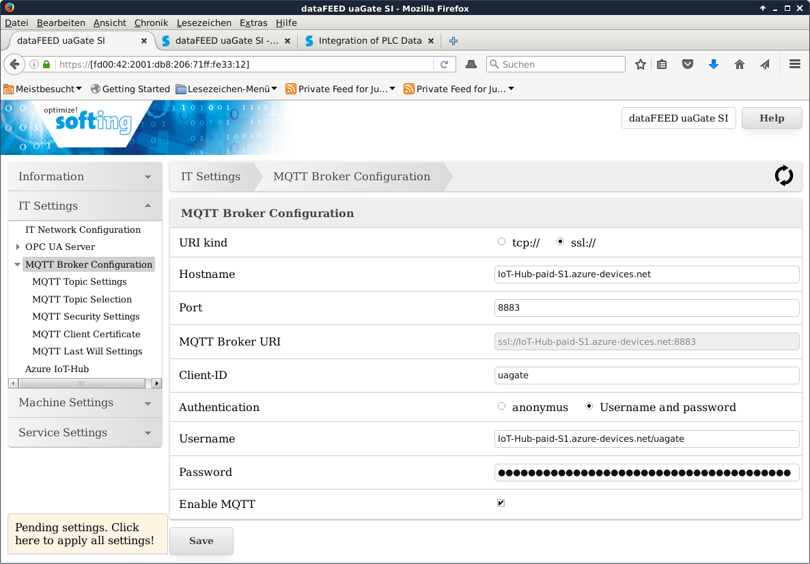
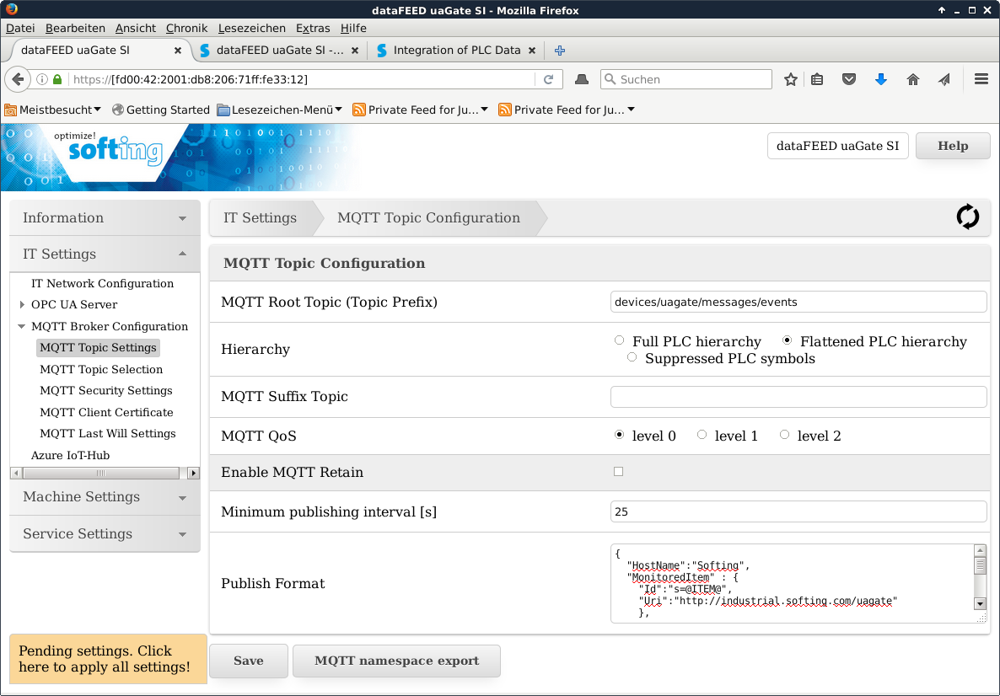

Configure [Stand-alone Application Gateways - Single Protocol](https://industrial.softing.com/en/products/plc-connectivity/integration-of-plc-data.html): dataFEED uaGate SI and dataFEED edgeGate as Azure IoT-device
===
---

# Table of Contents

-   [Introduction](#Introduction)
-   [Step 1: Prerequisites](#Prerequisites)
-   [Step 2: Prepare your Device](#PrepareDevice)
-   [Tips](#tips)

<a name="Introduction"></a>
# Introduction

**About this document**

This document describes how to connect dataFEED uaGate SI and dataFEED edgeGate device with Azure IoT. This multi-step process includes:
-   Configuring Azure IoT Hub
-   Registering your IoT device
-   Configure the device to publish PLC data to Azure IoT

<a name="Prerequisites"></a>
# Step 1: Prerequisites

You should have the following items ready before beginning the process:

-   [Setup your IoT hub][lnk-setup-iot-hub]
-   [Provision your device and get its credentials][lnk-manage-iot-hub]
-   Create a SAS token for your device as described in [iot-hub-mqtt-support](https://docs.microsoft.com/en-Us/azure/iot-hub/iot-hub-mqtt-support)
-   dataFEED uaGate SI or dataFEED edgeGate configured to connect to PLC.

<a name="PrepareDevice"></a>
# Step 2: Prepare your Device
-   Connect with a browser to the configuration web pages of the device.
-   Login as `administrator` or `itadmin`.
-   Navigate to the `MQTT Broker configuration` page, as in the screen shot below.

-   On the MQTT Broker Configuration page you need to enter the following:
-      The URI of your Azure IoT hub for MQTT connections. In the screenshot above: `IoT-Hub-paid-S1.azure-devices.net`.
-      The port number for secure MQTT connections: 8883.
-      The IoT-hub device-id of your device as client id. In the screenshot above the device-id is "uagate".
-      As user name you need to enter the name of your Azure IoT hub, ´.azure-devices.net/´ and the device-id. In the screenshot above: ´IoT-Hub-paid-S1.azure-devices.net/echocollect´.
-      You need to enter the SAS token, which you have created with the deviceExplorer for your device.
       You need to enter/copy the part after the ´SharedAccessSignature=´ part as password!
-   Use the save button to write your configuration changes into the device.

-   Navigate to the `MQTT Topic Settings` page, as in the screen shot below.

-   On the `MQTT Topic Settings` page you need to enter the following:
-      Set the MQTT Root Topic: `devices/<device-id>/messages/events`. In the screenshot above: `devices/uagate/messages/events`.
-      Select flattened PLC hierarchy.
-      Set the MQTT payload format string:

```
{
  "HostName":"Softing",
  "MonitoredItem" : {
    "Id":"s=@ITEM@",
    "Uri":"http://industrial.softing.com/uagate"
    },
  "Value": {
    "Value":"@VALUE@",
    "SourceTimestamp":"@TIME@",
    "ServerTimestamp":"@TIME@",
    "quality":"@QUALITY@"
    }
}
```

-       Select QoS0 or QoS1
-       Set the minimum sampling intervall as needed by your application. *ATTENTION:* The PLC data would be sampled with this rate, which could cause a huge ammount of messages to the Azure IoT hub!
-   Use the save button to write your configuration changes into the device.

-   Navigate to the `MQTT Topic Selection` page.
-   Choose the PLC symbols you want to send to your Azure IoT hub.
-   Use the save button to write your configuration changes into the device.
-   Finally use the `Pending settings` button to apply the update configuration.

<a name="tips"></a>
# Tips

Read [iot-hub-mqtt-support](https://docs.microsoft.com/en-Us/azure/iot-hub/iot-hub-mqtt-support) for further information how to publish data to IoT hub with protocoll MQTT.

[setup-devbox-linux]: https://github.com/Azure/azure-iot-sdk-c/blob/master/doc/devbox_setup.md
[lnk-setup-iot-hub]: ../setup_iothub.md
[lnk-manage-iot-hub]: ../manage_iot_hub.md
