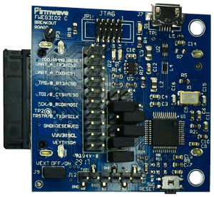

Run a simple C sample on a Firmwave Edge LTE Gateway device running FreeRTOS
===
---

# Table of Contents

-   [Introduction](#Introduction)
-   [Step 1: Prerequisites](#Prerequisites)
-   [Step 2: Prepare your Device](#PrepareDevice)
-   [Step 3: Build and Run the Sample](#Run)
-   [Next Steps](#NextSteps)

# Introduction

**About this document**

This document describes how to connect a LTE Gateway device running FreeRTOS with Azure IoT SDK. This multi-step process includes:
-   Configuring Azure IoT Hub
-   Registering your IoT device
-   Deploy Azure IoT SDK on device

# Step 1: Prerequisites

You should have the following items ready before beginning the process:

-   [Setup your IoT hub](https://github.com/azure/azure-iot-device-ecosystem/blob/master/setup_iothub.md)
-   [Provision your device and get its credentials](https://github.com/azure/azure-iot-device-ecosystem/blob/master/manage_iot_hub.md).
-   Firmwave Edge LTE Gateway device

-   OpenOCD compatible SWD programmer
-   USB-UART converter
-   Computer with a USB port

# Step 2: Prepare your Device

-   Send Azure IoT device connection string to Firmwave for firmware file generation.
-   Receive azure iot sample firmware from Firmwave.
-   Connect the breakout board and configure it as a OpenOCD programmer

# Step 3: Flash and Run the sample

-   Use OpenOCD with following configuration to flash the image:

        set WORKAREASIZE 0x60000
        set CHIPNAME atsame70q21
        transport select swd

        source [find target/atsamv.cfg]
 
        reset_config srst_only

-   Use the USB-UART converter to monitor the sample (115200-8N1)

## 3.1 Send Device Events to IoT Hub:

-  The sample application will automatically run and will start sending messages to the IoT Hub.

-   See [Manage IoT Hub](https://github.com/Azure/azure-iot-device-ecosystem/blob/master/manage_iot_hub.md) to learn how to observe the messages IoT Hub receives from the application.

# Next Steps

You have now learned how to run a sample application that collects sensor data and sends it to your IoT hub. To explore how to store, analyze and visualize the data from this application in Azure using a variety of different services, please click on the following lessons:

-   [Manage cloud device messaging with iothub-explorer]
-   [Save IoT Hub messages to Azure data storage]
-   [Use Power BI to visualize real-time sensor data from Azure IoT Hub]
-   [Use Azure Web Apps to visualize real-time sensor data from Azure IoT Hub]
-   [Weather forecast using the sensor data from your IoT hub in Azure Machine Learning]
-   [Remote monitoring and notifications with Logic Apps]   

[Manage cloud device messaging with iothub-explorer]: https://docs.microsoft.com/en-us/azure/iot-hub/iot-hub-explorer-cloud-device-messaging
[Save IoT Hub messages to Azure data storage]: https://docs.microsoft.com/en-us/azure/iot-hub/iot-hub-store-data-in-azure-table-storage
[Use Power BI to visualize real-time sensor data from Azure IoT Hub]: https://docs.microsoft.com/en-us/azure/iot-hub/iot-hub-live-data-visualization-in-power-bi
[Use Azure Web Apps to visualize real-time sensor data from Azure IoT Hub]: https://docs.microsoft.com/en-us/azure/iot-hub/iot-hub-live-data-visualization-in-web-apps
[Weather forecast using the sensor data from your IoT hub in Azure Machine Learning]: https://docs.microsoft.com/en-us/azure/iot-hub/iot-hub-weather-forecast-machine-learning
[Remote monitoring and notifications with Logic Apps]: https://docs.microsoft.com/en-us/azure/iot-hub/iot-hub-monitoring-notifications-with-azure-logic-apps
[setup-devbox-linux]: https://github.com/Azure/azure-iot-sdk-c/blob/master/doc/devbox_setup.md
[lnk-setup-iot-hub]: ../setup_iothub.md
[lnk-manage-iot-hub]: ../manage_iot_hub.md
