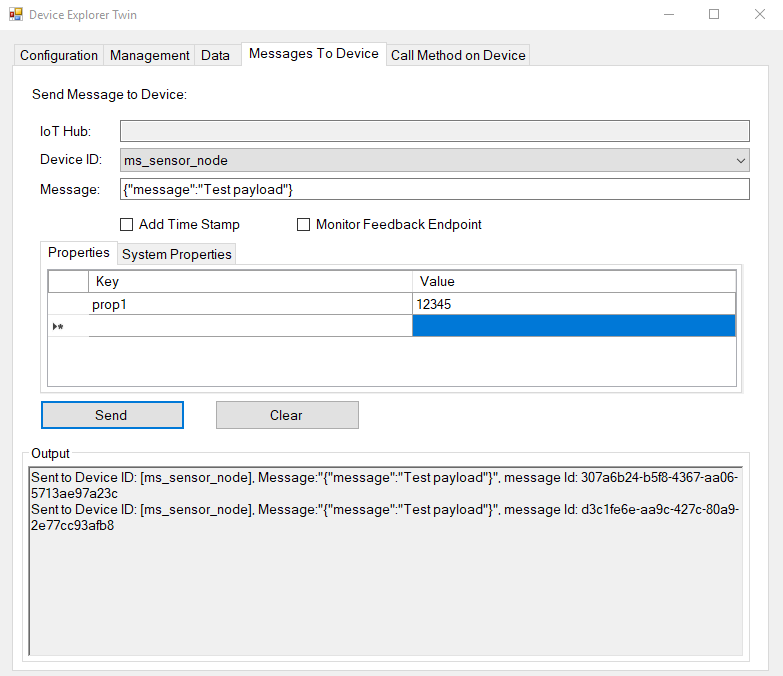
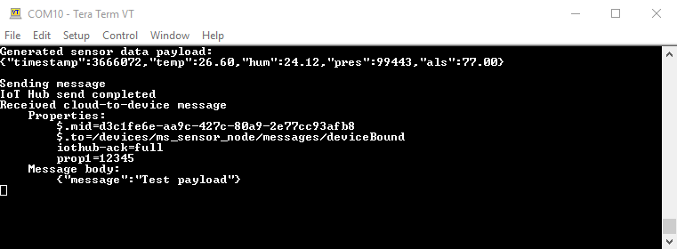

Run a simple C sample on IDK Base Board
===
---

# Table of Contents

-   [Introduction](#Introduction)
-   [Step 1: Prerequisites](#Prerequisites)
-   [Step 2: Prepare your Device](#PrepareDevice)
-   [Step 3: Build and Run the Sample](#Build)
-   [Next Steps](#NextSteps)

<a name="Introduction"></a>
# Introduction

**About this document**

This document describes how to connect [IDK Base Board][lnk-hw-baseboard] together with [Multi Sensor shield][lnk-hw-multisense] to Azure IoT Hub using the [IoT IDK IDE][lnk-hw-baseboard].
This multi-step process includes:
-   Configuring Azure IoT Hub
-   Registering your IoT device
-   Build and deploy Azure IoT SDK on device

<a name="Prerequisites"></a>
# Step 1: Prerequisites

You should have the following items ready before beginning the process.

## 1.1 Development environment

-   [IoT IDK IDE][lnk-hw-baseboard] installed in your PC. [BB-GEVK Software][lnk-hw-baseboard] (requires registration to onsemi.com)
-   [Setup your IoT Hub][lnk-setup-iot-hub]
-   [Provision your device and get its credentials][lnk-manage-iot-hub]
-   [Device Explorer tool][lnk-device-explorer] installed in your PC and configured for your IoT Hub instance.

**Note:**

IoT IDK IDE is available only for Windows.

## 1.2 Hardware Components

-   [IoT IDK Base Board][lnk-hw-baseboard] development board
-   [Multi Sensor shield][lnk-hw-multisense] with environmental, ambient light and inertial sensors.<br>

**Note:**

Use of [Multi Sensor shield][lnk-hw-multisense] is optional. Simulated sensor data can be enabled in the sample code.

<a name="PrepareDevice"></a>
# Step 2: Prepare your Device

Combine [IoT IDK Base Board][lnk-hw-baseboard] with [Multi Sensor shield][lnk-hw-multisense] as shown in the figure below.
Then connect the [IoT IDK Base Board][lnk-hw-baseboard] board to your PC using a mini USB cable.

![][img-bb-ms-angle]

<a name="Build"></a>
# Step 3: Build SDK and Run the sample

1.  Launch the [IoT IDK IDE][lnk-hw-baseboard] and select suitable workspace location.
2.  Import ````Azure connected Multi-Sensor node``` example code by using the ```Examples``` toolbar menu as seen in figure below.
   Configuration file ```ms_sensor_node_azure/src/configuration.h``` and sample application manual will be opened automatically after project import is finished.
   ![][img-ide-example-menu]
3.  Update opened configuration header definition ```IOTHUB_CONNECTION_STRING``` with the credentials retrieved during device registration as described in [Step 1.1][lnk-manage-iot-hub].
   Also update ```AP_SSID``` and ```AP_PASSPHRASE``` with SSID and password of your Wi-Fi access point.
   Optionally update ```USE_SIMULATED_SENSOR_DATA``` definition to ```true``` if you wish to run the sample without [Multi Sensor shield][lnk-hw-multisense].
   ![][img-ide-configuration]
4.  Save updated configuration file and build the project by clicking the build project icon in toolbar.
   ![][img-ide-build]
5.  To flash the compiled program into [IDK Base Board][lnk-hw-baseboard] follow these steps:


   1.  Select project folder you want to flash in Project Explorer.

        

   2.  Press the green USB Programming button in toolbar to launch the flashing tool.

        
   3. A pop-up window with the list of available devices will appear.
      Select COM port of [IDK Base Board][lnk-hw-baseboard] from the list and press ```Flash``` button.

        
   4. The utility will ask you to press restart button on [IDK Base Board][lnk-hw-baseboard] to start the flashing process.

        

        Placement of the ```RESET``` button on IDK Base Board can be see in figure below.

        
   5. After flashing is done the flashing utility will prompt you to restart the [IDK Base Board][lnk-hw-baseboard] again to run the new program.
      The utility can also act as serial terminal for the IDK Base Board if it is left open after flashing is complete.

       

6. Verify sent D2C data using Device explorer

   After the program is flashed and running it will print status messages over serial port.
   To see received messages either leave the Flash Utility open or use serial terminal application with the following parameters:

   -   Baud rate: 115200
   -   Data: 8 bit
   -   Parity: none
   -   Stop bits: 1 bit
   -   Flow control: none

   The status of following events will be printed to the terminal:
   
   -   Initialization of sensors used in this sample code was successfull.
   -   Connection to Wi-Fi acces point is initiated and device IP address will be printed on success.
        Device will automatically try to reconnect if access point is not found immediately or connection is lost.
   -   Device will attempt to connect to IoT Hub with confirmation printed on success.
   -   Sensor data will be sampled and published to IoT Hub every ```SEND_INTERVAL``` seconds.
        Message payload will contain JSON formatted sensor data including temperature, humidity, pressure and ablient light level.

    

    The [Device Explorer][lnk-device-explorer] tool can be used to verify that messages were correctly received by IoT Hub.
    Follow the instructions in [Monitor device-to-cloud event][lnk-device-explorer-monitor] section of Device Explorer manual to start monitoring device events.
    Once started all messages received by IoT Hub from selected device will appear in the window as shown below.

    


7.  Send Cloud to Device message to IoT IDK Base Board
    The sample application is also able to receive C2D messages from IoT Hub.
    To do so switch to the [Messages To Device][lnk-device-explorer-c2d] tab of Device Explorer, select ```Device ID``` of your device, enter custom message and press send button.
    Device Explorer will confirm that the message was sent to device and device will print its content over serial terminal as seen in figures below.

    

    

<a name="NextSteps"></a>
# Next Steps

You have now learned how to run a sample application that collects sensor data and sends it to your IoT hub. To explore how to store, analyze and visualize the data from this application in Azure using a variety of different services, please click on the following lessons:

-   [Manage cloud device messaging with iothub-explorer]
-   [Save IoT Hub messages to Azure data storage]
-   [Use Power BI to visualize real-time sensor data from Azure IoT Hub]
-   [Use Azure Web Apps to visualize real-time sensor data from Azure IoT Hub]
-   [Weather forecast using the sensor data from your IoT hub in Azure Machine Learning]
-   [Remote monitoring and notifications with Logic Apps]   

[Manage cloud device messaging with iothub-explorer]: https://docs.microsoft.com/en-us/azure/iot-hub/iot-hub-explorer-cloud-device-messaging
[Save IoT Hub messages to Azure data storage]: https://docs.microsoft.com/en-us/azure/iot-hub/iot-hub-store-data-in-azure-table-storage
[Use Power BI to visualize real-time sensor data from Azure IoT Hub]: https://docs.microsoft.com/en-us/azure/iot-hub/iot-hub-live-data-visualization-in-power-bi
[Use Azure Web Apps to visualize real-time sensor data from Azure IoT Hub]: https://docs.microsoft.com/en-us/azure/iot-hub/iot-hub-live-data-visualization-in-web-apps
[Weather forecast using the sensor data from your IoT hub in Azure Machine Learning]: https://docs.microsoft.com/en-us/azure/iot-hub/iot-hub-weather-forecast-machine-learning
[Remote monitoring and notifications with Logic Apps]: https://docs.microsoft.com/en-us/azure/iot-hub/iot-hub-monitoring-notifications-with-azure-logic-apps
[setup-devbox-windows]: https://github.com/Azure/azure-iot-sdk-c/blob/master/doc/devbox_setup.md


[lnk-setup-iot-hub]: ../setup_iothub.md
[lnk-manage-iot-hub]: ../manage_iot_hub.md
[lnk-device-explorer]: https://github.com/Azure/azure-iot-sdk-csharp/tree/master/tools/DeviceExplorer
[lnk-device-explorer-monitor]: https://github.com/Azure/azure-iot-sdk-csharp/tree/master/tools/DeviceExplorer#monitor
[lnk-device-explorer-c2d]: https://github.com/Azure/azure-iot-sdk-csharp/tree/master/tools/DeviceExplorer#send-cloud-to-device-messages

[lnk-hw-baseboard]:https://www.onsemi.com/PowerSolutions/evalBoard.do?id=BB-GEVK
[lnk-hw-multisense]:https://www.onsemi.com/PowerSolutions/evalBoard.do?id=MULTI-SENSE-GEVB

[img-bb-ms-angle]: ./media/iot-idk/BaseBoard-MultiSensorBoard-Angle.png
[img-ide-example-menu]: ./media/iot-idk/IDK-ExamplesMenu.png
[img-ide-configuration]: ./media/iot-idk/IDK-ConfigurationHeader.png
[img-ide-build]: ./media/iot-idk/IDK-Build.png
