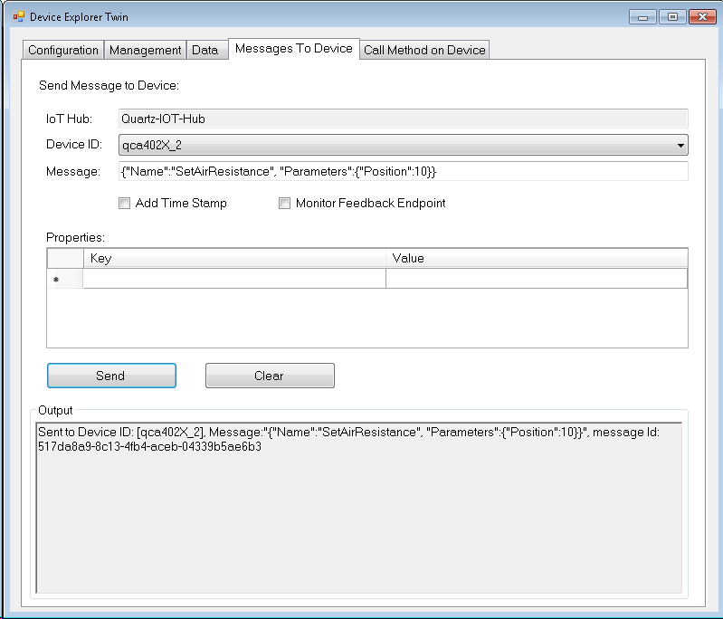
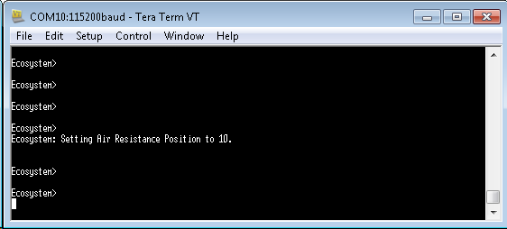

Run a simple C sample on QCA4020 device running RTOS
===
---

# Table of Contents

-   [Introduction](#Introduction)
-   [Step 1: Prerequisites](#Prerequisites)
-   [Step 2: Building sample applications](#BuildSample)
-   [Step 2-1: Supported toolchains](#BuildSample01)
-   [Step 2-2: Other requirements](#BuildSample02)
-   [Step 3: Building AZURE IOT SDK for QCA4020](#BuildSDK)
-   [Next Steps](#NextSteps)

# Introduction

**About this document**

The document describes the steps required to install, build and run Azure IoT SDK for C on a QCA4020 based development platform. This multi-step process includes:
-   Configuring Azure IoT Hub
-   Registering your IoT device
-   Build and deploy Azure IoT SDK on device

# Step 1: Prerequisites

You should have the following items ready before beginning the process:

-   [Setup your IoT hub][lnk-setup-iot-hub]
-   [Provision your device and get its credentials][lnk-manage-iot-hub]
-   QCA4020 device.
-   [Download QCA4020 SDK from Qualcomm portal][lnk-download-qca4020-sdk]. The software package for QCA4020 development kit is *qca4020-or-1-0_qca_oem_sdk*.
-   Download the following documents from <https://createpoint.qti.qualcomm.com>:
    -   80-Y9383-3 (QCA4020 Release Notes)
    -   80-Y9381-2 (QCA4020 Programmers Guide)
    -   80-Y9381-3 (QCA402X Development Kit Quick Start Guide)

# Step 2: Building sample applications

-   QCA402X SDK contains sample applications that demonstrate usage of Qualcomm APIs (QAPI) and provides a CLI -based interface to test chip features.
-   Refer to the Programmers Guide on steps to build the sample applications.

## Step 2.1: Supported toolchains

The SDK contains build scripts and Makefiles for the following toolchains:

-   GNU embedded toolchain for ARM- GNU toolchain for ARM-based processors. The toolchain supports Windows and Linux platform and can be downloaded from the ARM website at: 

    <https://developer.arm.com/open-source/gnu-toolchain/gnu-rm/downloads>

    Supported Version: 6.2

-   Add the path to toolchain binaries to 'PATH' environment variable.

    **Linux:**

        export PATH=$PATH:/path/to/bin

    **Windows:**

        set %PATH%=%PATH%:\path\to\bin

    ***Example:***

    If ARM GNU toolchain is installed under *C:\Program Files (x86)\GNU Tools ARM Embedded\4.9 2015q2\bin*, set path as follows:-

        set %PATH%=%PATH%:C:\Program Files (x86)\GNU Tools ARM Embedded\4.9 2015q2\bin

## Step 2.1: Other requirements

-   **Python:**

    Some of the support scripts are Python- based, Python 2.7.2 or higher.

    After installation, add the path to python. 

    ***Example:***

    If you have *python.exe* in *C:\CRMApps\Apps\Python276-64* folder, set path as follows: 

        set %PATH%=%PATH%:C:\CRMApps\Apps\Python276-64

-   **J-Link JTAG:**

    J-Link is an USB based JTAG debugger used by flash and debug scripts are provided in the SDK. The drivers for J-Link USB interface can be downloaded from:

    <https://www.segger.com/downloads/jlink>

    Download and install *J-Link Software and Documentation Pack*. After installation, add the path to 'JLinkGDBServer'.

    ***Example:***

    If you have *JLinkGDBServer.exe* in *C:\Program Files (x86)\SEGGER\JLink_V502h* folder, then, set path as follows. 

        set %PATH%=%PATH%:C:\Program Files (x86)\SEGGER\JLink_V502h

# Step 3: Building AZURE IOT SDK for QCA4020

## Download AZURE IOT SDK for C

Below steps assume that QCA4020 SDK has been installed at [target] location. 

Azure SDK in Quartz has been tested against branch 2017-07-14. Git client is required to clone the repository.

-   Navigate to *[target]\thirdparty* directory
-   Run the following command to clone

        git clone --recursive --branch 2017-07-14 https://github.com/Azure/azure-iot-sdk-c.git azure

## Building QCLI Demo with AZURE IOT SDK for C

Following steps should be followed to build the QCLI Demo with Azure support for the first time.

-   Azure SDK requires some utility functions from arm-none-eabi-gcc libs. To link with the required libraries, set the following environment variables

        SET NEWLIBPATH=C:\Program Files (x86)\GNU Tools ARM Embedded\6.2 2016q4\arm-none-eabi\lib\thumb

        SET TOOLLIBPATH=C:\Program Files (x86)\GNU Tools ARM Embedded\6.2 2016q4\lib\gcc\arm-none-eabi\6.2.1\thumb

        SET Ecosystem=azure

-   Navigate to the location of build scripts.

        cd target\quartz\demo\QCLI_Demo\build\gcc

-   Install Device configuration files.

        build.bat prepare

    Prepare command will install device configuration files under *src/export* directory. These device configuration files can now be edited to change system configuration. This command should only be run once, unless the configuration files are deleted. 

-   Build the sample application. The configuration parameters can be passed as command line parameters.

    | Parameter | Possible Values | Description |
    | --- | --- | --- |
    | 1 | f | FreeRTOS RTOS build |
    | | t | Threadx RTOS build |
    | | prepare | Install Device Configuration files |
    | | clobber | Delete Device Configuration files |
    | 2 | 4020 | Chipset variant |
    | | 4024 | |

    Following command will build threadx version of the application for QCA4020 module.

        build.bat t 4020

Refer to QCA4020 Programmers Guide on how to flash and run the QCLI Demo application.

## Supported Demos

Two sample applications are supported in the QCA402X SDK.

1.  **Simple sample MQTT:** this application provides a basic secure MQTT connection to the hub. It does not create a separate task and uses low level (non-OS dependent layer) in the Azure stack. This is a useful reference for simple applications and has a low memory footprint. It allows

    -   Querying data from the device
    -   Updating device parameters

2.  **Device-twin:** this application creates a separate thread to handle azure traffic and has a bigger memory footprint. Device twins are JSON documents that store all device state information. A back end can update desired properties and query reported properties. More information available at

    <https://docs.microsoft.com/en-us/azure/iot-hub/iot-hub-devguide-device-twins>

## Test Procedure

Following steps should be performed on QCLI Demo CLI console to test Azure demo application.

**Step 1.  Enable WLAN and connect to AP** 

    wlan enable
    wlan SetWpaPassphrase <PASSPHRASE>
    wlan SetWpaParameters WPA2 CCMP CCMP
    wlan connect <SSID>

**Step 2. Obtain IP Address**
 
    net dhcpv4c wlan0 new

**Step 3. Enable DNS Client, Add a Public DNS Server**
 
    net dnsc start
    net dnsc addsrv 8.8.8.8

**Step 4. Enable SNTP Client, add a Public SNTP server**

    net sntpc start
    net sntpc addsvr 24.56.178.140

**Step 5. Running simple sample demo (requires device specific connection string)**

    ecosystem azure-simple <Connection String>

/**On successful connection, you will see the following message ****/

    Ecosystem: Result Call Back Called! Result is: IOTHUB_CLIENT_CONFIRMATION_OK

Click "Refresh" on Device explorer, you will see the device in connected state.

 
**Step 6. Sending a message to the device** 

Select "Message To Device" tab on Device Explorer, select your device ID from drop down, and enter the following message

    {"Name":"SetAirResistance", "Parameters":{"Position":10}}

You will see the following message on device console
 

/**** Other commands to be tried *******/

    {"Name":"TurnFanOff", "Parameters":{}}
    {"Name":"TurnFanOn", "Parameters":{}}

**Step 7. Stopping Simple Sample Demo** 

    ecosystem azure-stop

# Next Steps

You have now learned how to run a sample application that collects sensor data and sends it to your IoT hub. To explore how to store, analyze and visualize the data from this application in Azure using a variety of different services, please click on the following lessons:

-   [Manage cloud device messaging with iothub-explorer]
-   [Save IoT Hub messages to Azure data storage]
-   [Use Power BI to visualize real-time sensor data from Azure IoT Hub]
-   [Use Azure Web Apps to visualize real-time sensor data from Azure IoT Hub]
-   [Weather forecast using the sensor data from your IoT hub in Azure Machine Learning]
-   [Remote monitoring and notifications with Logic Apps]   

[Manage cloud device messaging with iothub-explorer]: https://docs.microsoft.com/en-us/azure/iot-hub/iot-hub-explorer-cloud-device-messaging
[Save IoT Hub messages to Azure data storage]: https://docs.microsoft.com/en-us/azure/iot-hub/iot-hub-store-data-in-azure-table-storage
[Use Power BI to visualize real-time sensor data from Azure IoT Hub]: https://docs.microsoft.com/en-us/azure/iot-hub/iot-hub-live-data-visualization-in-power-bi
[Use Azure Web Apps to visualize real-time sensor data from Azure IoT Hub]: https://docs.microsoft.com/en-us/azure/iot-hub/iot-hub-live-data-visualization-in-web-apps
[Weather forecast using the sensor data from your IoT hub in Azure Machine Learning]: https://docs.microsoft.com/en-us/azure/iot-hub/iot-hub-weather-forecast-machine-learning
[Remote monitoring and notifications with Logic Apps]: https://docs.microsoft.com/en-us/azure/iot-hub/iot-hub-monitoring-notifications-with-azure-logic-apps
[setup-devbox-windows]: https://github.com/Azure/azure-iot-sdk-c/blob/master/doc/devbox_setup.md
[lnk-setup-iot-hub]: ../setup_iothub.md
[lnk-manage-iot-hub]: ../manage_iot_hub.md
[lnk-download-qca4020-sdk]: http://chipcode.qualcomm.com
