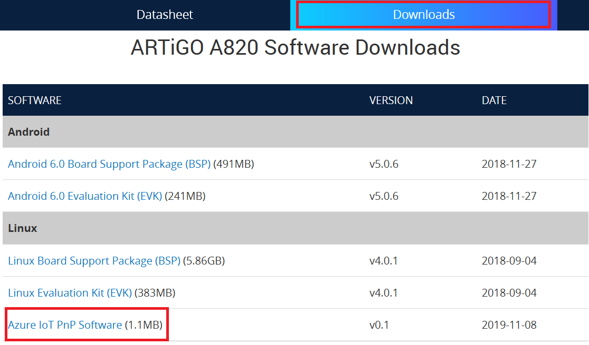

Connect VIA ARTiGO A820 device to your Azure IoT Central Application
===

---
# Table of Contents

-   [Introduction](#Introduction)
-   [Prerequisites](#Prerequisites)
-   [Create Azure IoT Central application](#Create_AICA)
-   [Device Connection Details](#DeviceConnectionDetails)
-   [Prepare the Device](#preparethedevice)
-   [Integration with IoT Central](#IntegrationwithIoTCentral)
-   [Additional Links](#AdditionalLinks)

<a name="Introduction"></a>
# Introduction 

**About this document**

This document describes how to connect VIA ARTiGO A820 to Azure IoT Central application using the IoT plug and Play model. Plug and Play simplifies IoT by allowing solution developers to integrate devices without writing any device code. Using Plug and Play, device manufacturers will provide a model of their device to cloud developers to be integrated quickly into IoT Central or any solution built on the Azure IoT platform. IoT Plug and Play will be open to the community by way of a definition language and SDKs.


The VIA ARTiGO A820 is an ultra-slim fanless enterprise IoT gateway system featuring robust networking connectivity options with dual Ethernet ports as well as optional high-speed wireless networking modules to enable flexible integration with the enterprise network and the cloud.

<a name="Prerequisites"></a>
# Prerequisites

You should have the following items ready before beginning the process: 

-   [Azure Account](https://portal.azure.com)
-   [Azure IoT Hub Instance](https://docs.microsoft.com/en-us/azure/iot-hub/about-iot-hub)
-   [Azure IoT Hub Device Provisioning Service](https://docs.microsoft.com/en-us/azure/iot-dps/about-iot-dps)
-   Provide Network connectivity (Wifi, LAN) supported by the device

<a name="preparethedevice"></a>
# Prepare the Device.

Hardware Environmental setup

-   Prepare VIA ARTiGO A820 and connect with HDMI, 5V DC adapter, Ethernet, and COM port.

Software Environmental Setup 

-   Download VIA ARTiGO A820 [Linux Evaluation Kit (EVK)](http://cdn.viaembedded.com/products/software/artigo-a820/Linux_EVK/ARTiGO-A820_Linux_EVK_V4.0.1_20180904.zip) from [VIA ARTiGO A820 Downloads](https://www.viatech.com/en/systems/small-form-factor-pcs/artigo-a820/).
-   Download VIA ARTiGO A820 [Linux Quick Start Guide](http://cdn.viaembedded.com/products/docs/artigo-a820/linux_evaluation_guide/ARTiGO-A820_Linux_EVK_v4.0.1_Quick_Start_Guide_v1.00_20180831.pdf) from [VIA ARTiGO A820 Downloads](https://www.viatech.com/en/systems/small-form-factor-pcs/artigo-a820/).
-   Follow the "Image Installation" in Quick Start Guide to install image on VIA ARTiGO A820 device.

-   Open putty or any tools to connect the COM port. You can see the message from VIA ARTiGO A820.
-   Download the [Azure IoT PnP Software](http://cdn.viaembedded.com/products/software/artigo-a820/Azure_IoT_PnP/VIA-ARTiGOA820-PnP-Package.tgz) from [VIA ARTiGO A820 Downloads](https://www.viatech.com/en/systems/small-form-factor-pcs/artigo-a820/).



-   Login VIA ARTiGO A820 with com port. The password is "root". Copy the __VIA-ARTiGOA820-PnP-Package.tgz__ to VIA ARTiGO A820 and extract the package by the command:

    ```bash
    $ tar zxvf VIA-ARTiGOA820-PnP-Package.tgz
    ```

<a name="IntegrationwithIoTCentral"></a>
# Integration with IoT Central

Azure IoT Central Setup

-   Create an __Azure IoT Central accout__ and launch the __public preview__ application.
-   Click ___Administaration -> Device Connection -> Certificates (X.509)___.
-   Upload and verify your certificate.
-   Generate a device __certificate__, __private key__ and remember your __Common Name__ and __Scope Id__.
-   Click ___Device templates -> + New___. Choose pre-certified device "__VIA ARTiGO A820__".

**VIA ARTiGO A820 Setup**

-   Copy your device __certificate__ and __private key__ to ___VIA-ARTiGOA820-PnP-Package/Certificate___ folder and rename as __device-ca.pem__ and __device-key.pem__, respectively. 
-   Modify the device-name and scope-id in ___VIA-ARTiGOA820-PnP-Package/pnp.conf___ to yours. The device-name is your certificate __Common Name__ and scope-id is your __Azure IoT Central Scope Id__.
-   Change directory to VIA-ARTiGOA820-PnP-Package and start the program by the command: 

    ```bash
    $ ./start.sh
    ```

**Check Azure IoT Central**
-   Clicks ___Devices___, and you can see that your VIA ARTiGO A820 register to IoT Central.
-   Click your VIA ARTiGO A820. You can see the messages from ARTiGO A820

 

<a name="AdditionalLinks"></a>
# Additional Links

Please refer to the below link for additional information for Plug and Play 

-   [Blog](https://azure.microsoft.com/en-us/blog/iot-plug-and-play-is-now-available-in-preview/)
-   [FAQ](TBD) 
-   [Plug and Play C SDK](https://github.com/Azure/azure-iot-sdk-c/tree/public-preview) 
-   [Plug and Play Node SDK](https://github.com/Azure/azure-iot-sdk-node/tree/digitaltwins-preview)
-   [Plug and Play Definitions](https://github.com/Azure/IoTPlugandPlay)
