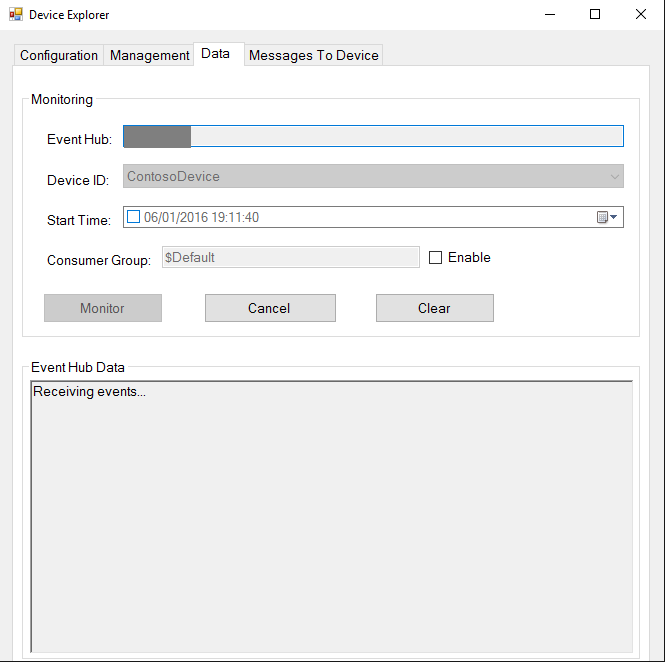
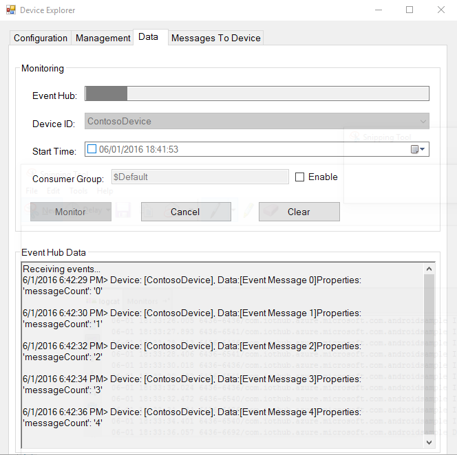
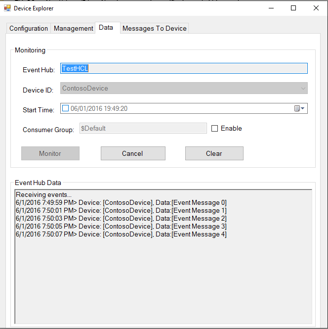
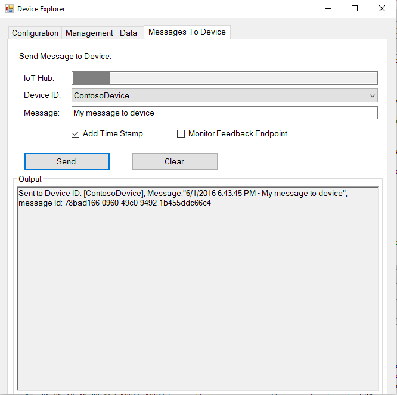

How to certify IoT devices running Android with Azure IoT SDK
===
---

# Table of Contents

-   [Introduction](#Introduction)
-   [Step 1: Sign Up To Azure IoT Hub](#Step_1)
-   [Step 2: Register Device](#Step_2)
-   [Step 3: Build and Validate the sample using Java client libraries](#Step_3)
    -   [3.1 Install Azure IoT Device SDK and prerequisites on device](#Step_3_1)
    -   [3.2 Run and Validate the Samples](#Step_3_2)
-   [Step 4: Package and Share](#Step_4)
    -   [4.1 Package build logs and sample test results](#Step_4_1)
    -   [4.2 Share with the Azure IoT Certification team](#Step_4_2)
    -   [4.3 Next steps](#Step_4_3)
-   [Step 5: Troubleshooting](#Step_5)

# Introduction

**About this document**

This document provides step by step guidance to IoT hardware publishers on how to certify an IoT enabled hardware with Azure IoT Java SDK. This multi-step process includes: 
-   Configuring Azure IoT Hub 
-   Registering your IoT device
-   Build and deploy Azure IoT SDK on device
-   Packaging and sharing the logs

**Prepare**

Before executing any of the steps below, read through each process, step by step to ensure end to end understanding.

You should have the following items ready before beginning the process:

-   Computer with GitHub installed and access to the
    [azure-iot-sdk-java](https://github.com/Azure/azure-iot-sdk-java) GitHub public repository.
-   Required hardware to certify.

# Step 1: Sign Up To Azure IoT Hub

Follow the instructions [here](https://account.windowsazure.com/signup?offer=ms-azr-0044p) on how to sign up to the Azure IoT Hub service.

As part of the sign up process, you will receive the connection string. 

-   **IoT Hub Connection String**: An example of IoT Hub Connection String is as below:

         HostName=[YourIoTHubName];SharedAccessKeyName=[YourAccessKeyName];SharedAccessKey=[YourAccessKey]

# Step 2: Register Device

-   Follow the instructions [here](<https://github.com/Azure/azure-iot-device-ecosystem/blob/master/manage_iot_hub.md>) on how to provision your device and get its credentials.

# Step 3: Build and Validate the sample using Java client libraries

This section walks you through building, deploying and validating the IoT Client SDK on your device running an Android OS version 4.0.3 or greater. You will install the necessary prerequisites on your device. Once done, you will build and deploy the IoT Client SDK, and validate the sample tests required for IoT certification with the Azure IoT SDK.

## 3.1 Prepare your development environment

-   Download and install latest JDK from [here](<http://www.oracle.com/technetwork/java/javase/downloads/index.html>).

-   Download [Android Studio](<https://developer.android.com/studio/index.html> on your Windows machine and follow the installation instructions.

- Plug in your device to your development machine with a USB cable. If you're developing on Windows, you might need to install the appropriate USB driver for your device. For help installing drivers, see the [OEM USB Drivers](<https://developer.android.com/studio/run/oem-usb.html>) document.
- Enable USB debugging on your device. On Android 4.0 and newer, go to Settings > Developer options.

    ***Note***: *On Android 4.2 and newer, Developer options is hidden by default. To make it available, go to Settings > About phone and tap Build number seven times. Return to the previous screen to find Developer options.*

## 3.2 Build the Samples

1.  Start a new instance of Android Studio and open Android project from here:

        azure-iot-sdk-java/java/device/samples/android-sample/

2.  Go to **MainActivity.java**, replace the **[device connection string]** placeholder with connection string of the device you have created in [Step 2](#Step_2) and save the file.

3. Build your project by going to **Build** menu **> Make Project**.

## 3.3 Run and Validate the Samples

In this section you will run the Azure IoT client SDK samples to validate
communication between your device and Azure IoT Hub. You will send messages to the Azure IoT Hub service and validate that IoT Hub has successfully receive the data. You will also monitor any messages sent from the Azure IoT Hub to client.

***Note:*** *Take screenshots of all the operations you will perform in this
section. These will be needed in [Step 4](#Step_4_2).*

### 3.2.1 Run the Sample:

#### Run on the Device

- Select one of your project's files and click Run  from the toolbar.
- In the Choose Device window that appears, select the **Choose a running device** radio button, select your device, and click OK . 
- Android Studio will install the app on your connected device and starts it.

#### Run on the Emulator

1.  Launch the **AVD Manager** from **Tools** menu **> Android > AVD Manager**.
2.  Launch a virtual device in emulator. If no device is shown in the list, create one.
3.  Once device is loaded and running, **Run** your app from **Run** menu **> Run 'module_name'** or by clicking **Shift + F10**.
4.  Select your virtual device from the **Select Deployment Target** pop-up window.
5.  Your app will load in the emulator.

### 3.2.2 Send Device Events to IoT Hub:

1.  Launch the DeviceExplorer as explained in [Step 2](#Step_2) and navigate to **Data** tab. Select the device name you created from the drop-down list of device IDs and click **Monitor** button.

    

2.  DeviceExplorer is now monitoring data sent from the selected device to the IoT Hub.

3.  As soon as you run the app on your device (or emulator), it will start sending messages to IoTHub.

4.  Check the **Android Monitor** window. Verify that the confirmation messages show an OK. If not, then you may have incorrectly copied the device hub connection information.

    **If using HTTP protocol:**  
    

    **If using MQTT protocol:**  
    

6.  DeviceExplorer should show that IoT Hub has successfully received data sent by sample test.

    **If using HTTP protocol:**  
    

    **If using MQTT protocol:**  
    

### 3.2.3 Receive messages from IoT Hub

1.  To verify that you can send messages from the IoT Hub to your device, go to the **Messages To Device** tab in DeviceExplorer.

2.  Select the device you created using Device ID drop down.

3.  Add some text to the Message field, then click Send.

    

4.  Click the **Receive Messages** button from the sample App UI loaded on your device or in the emulator.

5.  Check the **Android Monitor** window. You should be able to see the command received.

    **If using HTTP protocol:**  
    

    **If using MQTT protocol:**  
    

# Step 4: Package and Share

## 4.1 Package build logs and sample test results

Package the following artifacts from your device:

1.  Build logs and test results that were logged in the log files during steps 3.1.4 and 3.1.5.

2.  All the screenshots that are shown above in "**Send Device Events to IoT Hub**" section.

3.  All the screenshots that are above in "**Receive messages from IoT Hub**" section.

4.  Send us clear instructions of how to run this sample with your hardware
    (explicitly highlighting the new steps for customers). 
    
    As a guideline on how the instructions should look please refer the examples published on GitHub repository [here](<https://github.com/Azure/azure-iot-device-ecosystem/tree/master/get_started>).

## 4.2 Share with the Azure IoT Certification team

1.  Go to [Partner Dashboard](<https://catalog.azureiotsuite.com/devices>).
2.  Click on Upload icon at top-right corner of your device.

    

3.  This will open an upload dialog. Browse your file(s) by clicking **Upload** button.

    

    You can upload multiple files for same device.

4.  Once you have uploaded all the files, click on **Submit for Review** button.

    ***Note:*** *Please contact iotcert team to change/remove the files once you submit them for review.*
 

## 4.3 Next steps

Once you shared the documents with us, we will contact you in the following 48 to 72 business hours with next steps.

# Step 5: Troubleshooting

Please contact engineering support on <iotcert@microsoft.com> for help with troubleshooting.