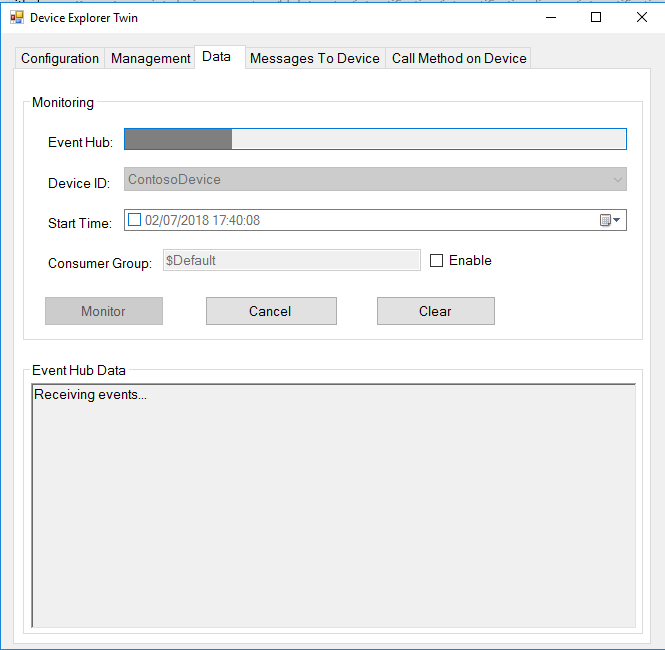
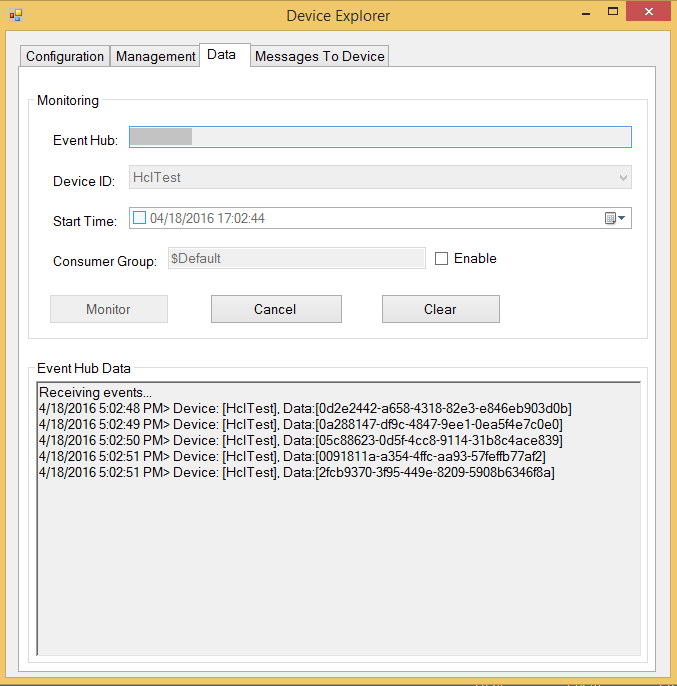
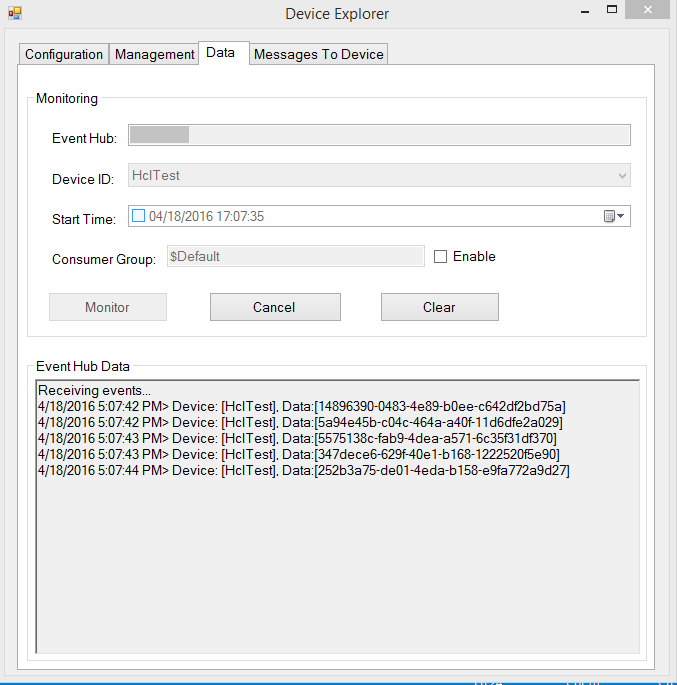
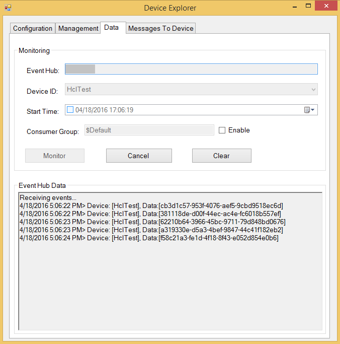
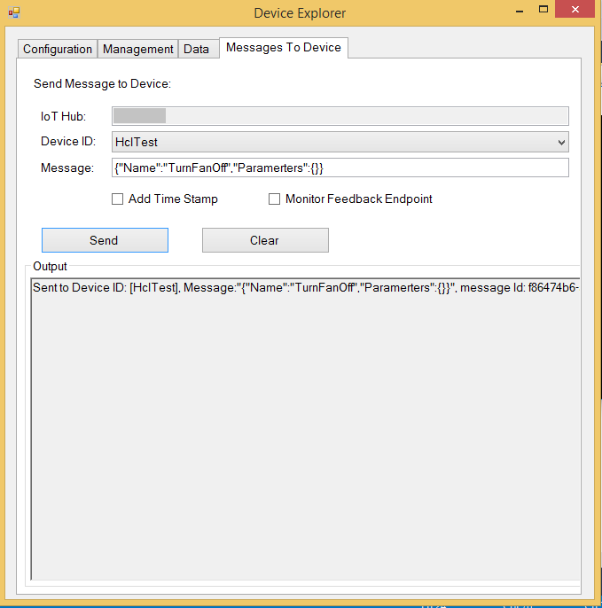
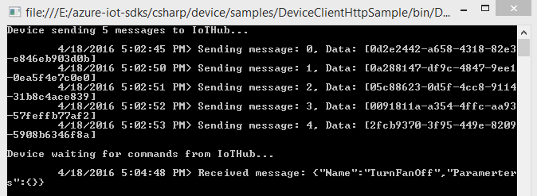
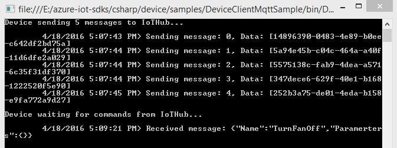
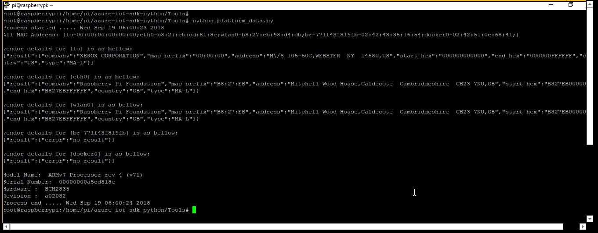

How to certify ARM 32 IoT devices running .NET Core within a Linux Docker container (Linux is also the host OS).
===
---

# Table of Contents

-   [Introduction](#Introduction)
-   [Step 1: Configure Azure IoT Hub](#Step-1-Configure)
-   [Step 2: Register Device](#Step-2-Register)
-   [Step 3: Build and Validate the sample using C client libraries](#Step-3-Build)
    -   [3.1 Load the Azure IoT bits and prerequisites on device](#Step-3-1-Load)
    -   [3.2 Build the samples](#Step-3-2-Build)
    -   [3.3 Run and Validate the Samples](#Step-3-3-Run)
-   [Step 4: Package and Share](#Step-4-Package_Share)
    -   [4.1 Package build logs and sample test results](#Step-4-1-Package)
    -   [4.2 Share package with Engineering Support](#Step-4-2-Share)
    -   [4.3 Next steps](#Step-4-3-Next)
-   [Step 5: Troubleshooting](#Step-5-Troubleshooting)

# Introduction

**About this document**

This document provides step-by-step guidance to IoT hardware publishers on how to certify an IoT enabled hardware with Azure IoT SDK. This multi-step process includes:

-   Configuring Azure IoT Hub
-   Registering your IoT device
-   Build and deploy Azure IoT SDK on device
-   Packaging and sharing the logs

**Prepare**

Before executing any of the steps below, read through each process, step
by step to ensure end to end understanding.

You should have the following items ready before beginning the process:

-   Computer with GitHub installed and access to the [azure-iot-sdk-csharp](https://github.com/Azure-Samples/azure-iot-samples-csharp) GitHub public repository.
-   Install Visual Studio 2015 and Tools. You can install any edition of Visual Studio, including the free Community edition.
-   SSH client, such as PuTTY, so you can access the command line of your device.
-   Install Docker on both your development machine and your device: https://www.docker.com/get-started

***Note:*** *If you haven't contacted Microsoft about being an Azure Certified for IoT partner, please submit this [form](<https://catalog.azureiotsuite.com/>) first to request it and then follow these instructions.*

# Step 1: Sign Up To Azure IoT Hub

[Sign up](https://account.windowsazure.com/signup?offer=ms-azr-0044p) to the Azure IoT Hub service and follow the instructions mentioned [here](https://docs.microsoft.com/en-us/azure/iot-hub/iot-hub-csharp-csharp-getstarted#create-an-iot-hub). As part of the sign up process, you will receive the connection string.

-   **IoT Hub Connection String**: An example of IoT Hub Connection String is as below:

         HostName=[YourIoTHubName];SharedAccessKeyName=[YourAccessKeyName];SharedAccessKey=[YourAccessKey]

# Step 2: Register Device

In this section, you will register your device using DeviceExplorer. The DeviceExplorer is a Windows application that interfaces with Azure IoT Hub and can perform the following operations:

-   Device management
    -   Create new devices
    -   List existing devices and expose device properties stored on Device Hub
    -   Provides ability to update device keys
    -   Provides ability to delete a device
-   Monitoring events from your device
-   Sending messages to your device

To run DeviceExplorer tool, use following configuration string as described in
[Step1](#Step-1-Configure):

-   IoT Hub Connection String

**Steps:**
1.  Click [here](<https://github.com/Azure/azure-iot-sdk-csharp/blob/master/tools/DeviceExplorer/doc/how_to_use_device_explorer.md>) to download and install DeviceExplorer.

2.  Add connection information under the Configuration tab and click the **Update** button.

3.  Create and register the device with your IoT Hub using instructions as below.

    a. Click the **Management** tab.

    b. Your registered devices will be displayed in the list. In case your device is not there in the list, click **Refresh** button. If this is your first time, then you shouldn't retrieve anything.

    c. Click **Create** button to create a device ID and key.

    d. Once created successfully, device will be listed in DeviceExplorer.

    e. Right click the device and from context menu select "**Copy connection
    string for selected device**".

    f. Save this information in Notepad. You will need this information in
    later steps.

***Not running Windows on your PC?*** - Please follow the instructions [here](<https://github.com/Azure/azure-iot-device-ecosystem/blob/master/manage_iot_hub.md>) to provision your device and get its credentials.

# Step 3: Build a Linux Docker image that includes the .NET Core runtime and the sample used for validating your device.

This sections walks you through building a Linux Docker image and running the image to validate the IoT Client SDK on your ARM 32 device.  Unless specified otherwise, the Docker image will contain all necessary prerequisites for running the sample tests required for IoT certification on your device.

## 3.1 Prepare your development environment

- Install the latest .NET Core from https://dot.net
- Install .NET Framework 4.7 Developer Pack: https://support.microsoft.com/en-us/help/3186612/the-net-framework-4-7-developer-pack-and-language-packs
- Install .NET Framework 4.5.1 Developer Pack: https://www.microsoft.com/en-us/download/details.aspx?id=40772

## 3.2 Build and push the Docker image to your registry

Using [this Dockerfile](TODO), build a Docker image that is based on the [.NET Core Arm32 Linux image](https://hub.docker.com/_/microsoft-dotnet-core-samples/):

-   In your development environment, open the directory containing [azure-iot-sdk-csharp](https://github.com/Azure-Samples/azure-iot-samples-csharp); specifically, open the following directory:

        iot-hub\Samples\device\MessageSample

-   Copy and paste [this Dockerfile](TODO) to the MessageSample directory shown above.
-   Add the IoT Hub device connection string as an environment variable within the Dockerfile.  Specifically, open the Dockerfile and replace '<your_device_connection_string>' with your device connection string and save your changes.
-   Using Docker and the Dockerfile, build a Docker image that containerizes the .NET Core Message Sample app.  Next, push this image to your Docker registry.  For example:

        cd iot-hub\Samples\device\MessageSample
        docker build -t <your_docker_account>/<your_docker_repo>:<your_img_tag> .
        docker push <your_docker_account>/<your_docker_repo>:<your_img_tag>

The sample contains two types of tests - one for sending messages to IoT Hub and another for receiving messages from IoT Hub. Both tests support different protocols. You can modify the tests to use your choice of protocol before building the Docker image. By default the tests will build using the AMQP protocol.

To run different protocols:

-   In your development environment, open the following file in notepad:

        iot-hub\Samples\device\MessageSample\Program.cs

-   Scroll down to the section of code containing the protocol information.

-   Find the below code:

        private static TransportType s_transportType = TransportType.Amqp;

    The default protocol used is AMQP. Code for other protocols(HTTP/MQTT) are mentioned just below the above line in the script. Comment/Uncomment the line as per the protocol you want to use and save your changes.

-   Rebuild the Docker image using the steps described at the beginning of Step 3.2.

## 3.3 Run and validate the sample

In this section you will run the sample to validate the communication between your device and Azure IoT Hub. You will send the messages to the Azure IoT Hub service and validate that IoT Hub has successfully receive the data. You will also monitor any messages sent from the Azure IoT Hub to client.

***Note:*** *Take screenshots of all the operations you will perform in this
section. These will be needed in [Step 4](#Step_4_2:_Share).*

### 3.3.1 Send Device Events to IoT Hub

1.  Launch the DeviceExplorer as explained in [Step 2](#Step_2:_Register) and navigate to **Data** tab. Select the device name you created from the drop-down list of device IDs and click **Monitor** button.

    

2.  DeviceExplorer is now monitoring data sent from the selected device to the IoT Hub.

3.  Open a PuTTY session and connect to the device, run the sample by pulling and running the Docker image.  For example:
		
        docker run --rm <your_docker_account>/<your_docker_repo>:<your_img_tag>
    
4. You should be able to see the events received in device console on successful execution.

	**If HTTP protocol:**

	

	**If MQTT protocol:**

	

	**If AMQP protocol:**

	

5. You should be able to see the events received in the DeviceExplorer's data tab.

	**If HTTP protocol:**	

     

	**If MQTT protocol:**

	 

	**If AMQP protocol:**
	
	 

### 3.3.2 Receive messages from IoT Hub

1.  To verify that you can send messages from the IoT Hub to your device, go to the **Messages to Device** tab in DeviceExplorer.

2.  Select the device you created using Device ID drop down.

3.  Add some text to the Message field, then click Send.

   	

4. You should be able to see the message received in the device console window.
	
	**If HTTP protocol:**

	

	**If MQTT protocol:**

	

	**If AMQP protocol:**

	
    
### 3.3.3 Verify Device configuration

-   Please install python by following below command.

    **Debian or Ubuntu**

        sudo apt-get install python

    **Fedora**

        sudo dnf install python

-    *This library also requires Python version 2.7.x. You can verify the current version installed in your environment using the following command:*
    
          python --version

-	Please install the below modules before you run the `platform_data.py`

    **Debian or Ubuntu** 

        sudo apt-get install python-requests
        sudo apt-get install python-netifaces

    **Fedora**

        sudo dnf install python-requests
        sudo dnf install python-netifaces

-   Download the SDK by issuing following command:

        git clone https://github.com/Azure/azure-iot-sdk-python.git

-   Navigate to tools folder by executing following command:

        cd azure-iot-sdk-python/Tools

-   Run the following command on the device
		
        python platform_data.py

    

-   Please save the device configuration screenshot and upload it as mentioned in [Step 4](#Step-4-1-Package).

# Step 4: Package and Share

## 4.1 Package build logs and sample test results

Package following artifacts from your device:

1.  Build logs that were logged in the log files during build run.

2.  All the screenshots that are shown above in "**Send Device Events to IoT Hub**" section.

3.  All the screenshots that are above in "**Receive messages from IoT Hub**" section.

4.  All the screenshots that are above in "**Device Configuration**" section.

5.  Send us clear instructions of how to run this sample with your hardware
    (explicitly highlighting the new steps for customers). Please use the template available [here](<https://github.com/Azure/azure-iot-device-ecosystem/blob/master/iotcertification/templates/template-linux-c.md>) to create your device-specific instructions.
    
    As a guideline on how the instructions should look please refer the examples published on GitHub repository [here](<https://github.com/Azure/azure-iot-device-ecosystem/tree/master/get_started>).

## 4.2 Share package with Microsoft Azure IoT team

1.  Go to [Partner Dashboard](<https://catalog.azureiotsuite.com/devices>).
2.  Click on Upload icon at top-right corner of your device.

    

3.  This will open an upload dialog. Browse your file(s) by clicking **Upload** button.

    

    You can upload multiple files for same device.

4.  Once you have uploaded all the files, click on **Submit for Review** button.

    ***Note:*** *Please contact iotcert team to change/remove the files once you submit them for review.*

## 4.3 Next steps

Once you shared the documents with us, we will contact you in the following 48 to 72 business hours with next steps.

# Step 5: Troubleshooting

Please contact engineering support on <iotcert@microsoft.com> for help with
troubleshooting.
