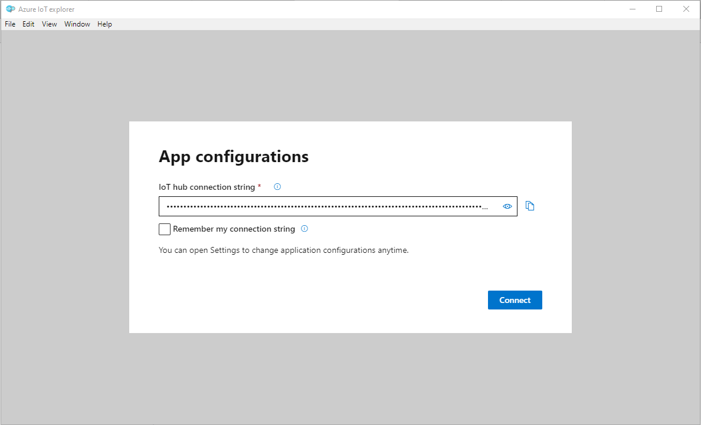
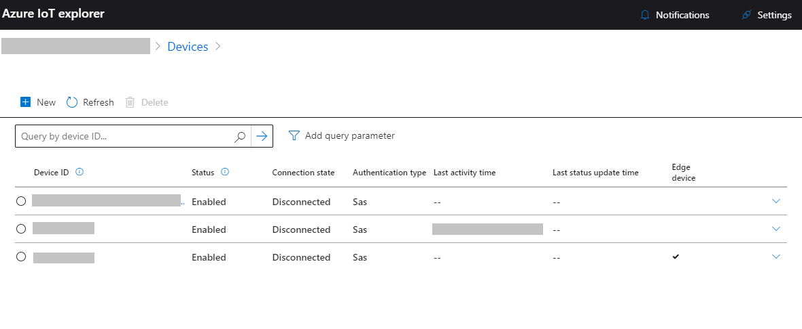
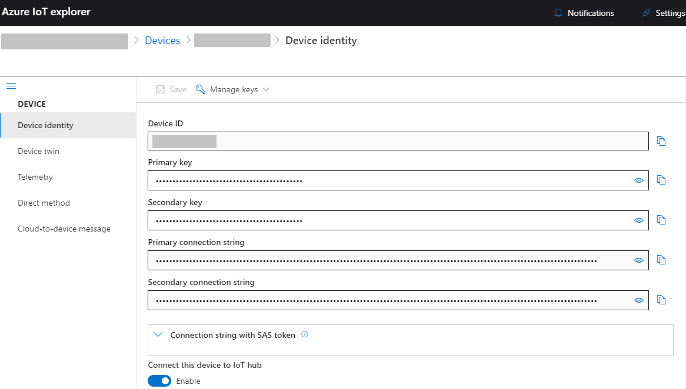

# Manage IoT Hub Devices

Before a device can communicate with IoT Hub, you must add details of that device to the IoT Hub device identity registry. When you add a device to your IoT Hub device identity registry, the hub generates the connection string that the device must use when it establishes its secure connection to your hub. You can also use the device identity registry to disable a device and prevent it from connecting to your hub.

To add devices to your IoT hub and manage those devices, you can use either of:

- The Command-line [Azure CLi](#azure-cli) tool
- The Windows-only, graphical [Azure IOT Explorer](#pnp-explorer)

Use either of these tools to generate a device-specific connection string that you can copy and paste in the source code of the application running on your device. Both tools are available in this [repository][lnk-this-repo].
 
> Note: While IoT Hub supports multiple authentication schemes for devices, both these tools generate a pre-shared key to use for authentication.

> Note: You must have an IoT hub running in Azure before you can provision your device. The document [Set up IoT Hub][setup-iothub] describes how to set up an IoT hub.

You can also use both of these tools to monitor the messages that your device sends to an IoT hub and send commands to you your devices from IoT Hub.

## Use Azure CLi and Azure Cli extensions to provision a device

The Azure IoT extension for Azure CLI aims to accelerate the development, management and automation of Azure IoT solutions. It does this via addition of rich features and functionality to the official Azure CLI.

Install [Azure CLI and CLI Extensions ](https://github.com/azure/azure-iot-cli-extension)

You must have at least v2.0.76, which you can verify with

     az --version

To provision a new device:

- Get the connection string for your IoT hub. See [Set up IoT Hub][setup-iothub] for more details.

- Run the following command to register your device with your IoT hub. 
      
        az login

- Set the default subscription ID
      
        az account set -s 'Enter your subscritpion ID here'

- Create your [device](https://docs.microsoft.com/en-us/cli/azure/ext/azure-cli-iot-ext/iot/hub/device-identity?view=azure-cli-latest#ext-azure-cli-iot-ext-az-iot-hub-device-identity-create) 

- Copy and save the device connection string information for later use
       
        az iot hub device-identity show-connection-string -n hubname -d devicename
       
- The samples in this repository use connection strings in the format 

        HostName=<iothub-name>.azure-devices.net;DeviceId=<device-name>;SharedAccessKey=<device-key>

- To get help on using the Azure CLI IoT Extension  to perform other tasks such as listing devices, deleting devices, and sending commands to devices, enter the following command
    
         az iot hub device-identity --help

For further information about using the Azure CLI Extension to perform tasks such as disabling a device, monitoring a device, and sending commands to a device see:

- [Working with the device identity registry](https://docs.microsoft.com/en-us/cli/azure/ext/azure-cli-iot-ext/iot/hub/device-identity?view=azure-cli-latest)
- [Working with monitoring devices](https://docs.microsoft.com/en-us/cli/azure/ext/azure-cli-iot-ext/iot/hub?view=azure-cli-latest#ext-azure-cli-iot-ext-az-iot-hub-monitor-events)

## Azure IOT Explorer for Windows

This application provides users an easy and visualized way to interact with Azure IoT devices.

1.  Go to the [releases tab](https://github.com/Azure/azure-iot-explorer), download the installer corresponding to your platform and install.
2.  Fill in IoT Hub connection string and that's it.

    

3.  You can see the list of devices which are connected to your IoT Hub. And also, You can create the device by clicking the **New** button.

    

4.  You can Copy the connection string from here to the clipboard. You can now paste this connection-string into the source code of the device application you are working with. The samples in this repository use connection strings in the format `HostName=<iothub-name>.azure-devices.net;DeviceId=<device-name>;SharedAccessKey=<device-key>`.

    

By using the Azure IOT Explorer tool you can perform more tasks such as disabling a device, monitoring a device, and sending commands to a device, etc...

### Development Setup

**Download a pre-built version**

Go to the [Releases](https://github.com/Azure/azure-iot-explorer/releases) tab, download the installer corresponding to your platform and install.

**Run it locally and build it yourself**

1.  Open a Node capable command prompt
2.  Clone the repo: `git clone https://github.com/Azure/azure-iot-explorer.git`
3.  Run: `npm install`
4.  Run: `npm start`
    - A new tab in your default browser will be opened automatically pointing to the locally running site.
5.  [optional] Stop step 4 then run: `npm run build` and then run: `npm run electron`.
    - The electron app will spin up using the bits generated in the dist folder.

If you'd like to package the app yourself, please refer to the [FAQ](https://github.com/Azure/azure-iot-explorer/wiki/FAQ).

[setup-iothub]: setup_iothub.md
[lnk-this-repo]: https://github.com/Azure/azure-iot-sdks
[lnk-install-iothub-explorer]: ../tools/iothub-explorer/readme.md#install
[lnk-iothub-explorer-identity]: ../tools/iothub-explorer/readme.md#identityregistry
[lnk-iothub-explorer-devices]: ../tools/iothub-explorer/readme.md#devices
